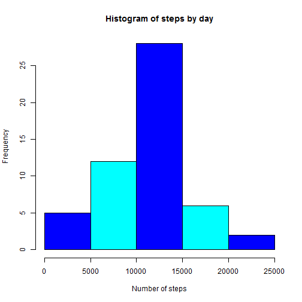
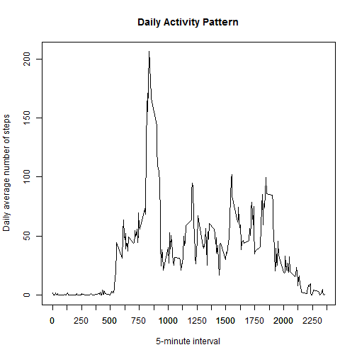
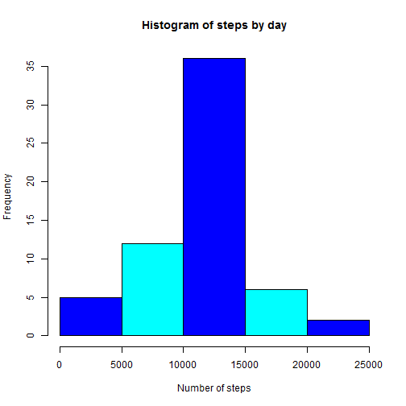
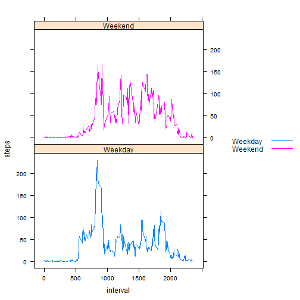
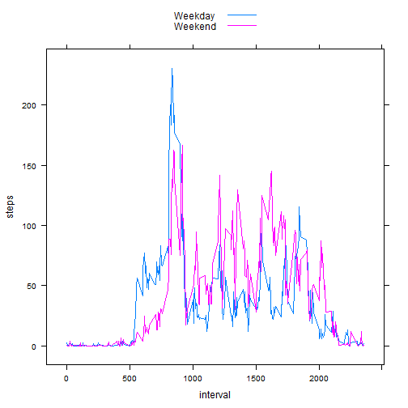

##Data

Let's start loading the required packages and reading the data from the working directory


```r
require(lattice)

data <-read.csv("activity.csv", header = TRUE)
```

To give answer to the first question, I will process the data calculating the total number of steps by day


```r
by.date <- aggregate(steps ~ date, data = data, sum)
```


##What is the mean total number of steps taken per day?

###1. Histogram of total number of steps taken each day


```r
histogram <- hist(by.date$steps,
                  breaks = 5,
                  col = c("blue",5),
                  main = "Histogram of steps by day",
                  xlab = "Number of steps")
```

 

The most frecuent values are concentrated between 10,000 and 15,000 steps per day, with a frecuency greater than 25 times. That means that more than 25 days over the 53 that contain the data set (no missing values are counted) have a total number of steps between 10,000 and 15,000.

###2. Mean and Median of total number of steps taken per day


```r
smean <- mean(by.date$steps)                     ##Apply mean() to the variable containing the total number of steps by date. This data set was created on the previous section
print(paste("mean:",round(smean,2),sep = " "))
```

```
## [1] "mean: 10766.19"
```

```r
smedian <- median(by.date$steps)
print(paste("meadian:",smedian,sep = " "))
```

```
## [1] "meadian: 10765"
```


##What is the average daily activity pattern?

To answer this question, it is necesary to calculate the average steps by 5-minute interval.


```r
by.interval <- aggregate(steps ~ interval, data = data, mean)
names(by.interval) <- c("interval", "steps.mean")
```

###1. Time series plot of the 5-minute interval (x-axis) and the average number of steps taken, averaged across all days (y-axis)


```r
daily.act.pat <- plot(by.interval$interval, by.interval$steps, 
                      type = 'l',
                      main = "Daily Activity Pattern",
                      xlab = "5-minute interval",
                      ylab = "Daily average number of steps")
axis(1, xaxp = c(0, 2500, 20))
```

 


###2. Which 5-minute interval, on average across all the days in the dataset, contains the maximum number of steps?


```r
max_avg <- by.interval[by.interval$steps==max(by.interval$steps),]  ##it filters the data set by.interval (average steps by 5-minute interval) to the row with the maximun value of the variable "steps"
```

The maximun number of steps (on average across all days) and the 5-minute interval it happens is:


```r
print(max_avg)
```

```
##     interval steps.mean
## 104      835   206.1698
```

##Imputing missing values

###1. Calculate and report the total number of missing values in the dataset.


```r
summary(data)
```

```
##      steps                date          interval     
##  Min.   :  0.00   2012-10-01:  288   Min.   :   0.0  
##  1st Qu.:  0.00   2012-10-02:  288   1st Qu.: 588.8  
##  Median :  0.00   2012-10-03:  288   Median :1177.5  
##  Mean   : 37.38   2012-10-04:  288   Mean   :1177.5  
##  3rd Qu.: 12.00   2012-10-05:  288   3rd Qu.:1766.2  
##  Max.   :806.00   2012-10-06:  288   Max.   :2355.0  
##  NA's   :2304     (Other)   :15840
```

```r
na <- is.na(data$steps)             ##Logical vector: TRUE when Na FALSE otherwise
na.percentage <- sum(na)/length(na) ##To compute percentage of Na's in the data set
print(paste("Number of Na's:", sum(na),sep = " "))
```

```
## [1] "Number of Na's: 2304"
```

```r
print(paste("Percentage of Na's: ",round(na.percentage*100,2),"%", sep = ""))
```

```
## [1] "Percentage of Na's: 13.11%"
```


###2. Filling missing data

I have choosen to fill the missing data with the average steps by 5-minute interval,i.e.if a record is missed on 2012-10-01 and in the 5-minute interval = 15, this missing record is replaced by the average of steps of the 5-minute interval = 15


```r
data.i <- data                ##data.i will represent the data set with the filled missing values 

  for(i in 1:dim(data.i)[1])  ##This loop replace Na's by the average number of step by interval
  {
    if(is.na(data.i$steps[i]))
    {
      data.i$steps[i] <- round(as.numeric(by.interval[by.interval$interval == data.i$interval[i],][2]),0)
    }
  }
##Remember by.interval is a data frame containing average steps by 5-minute interval
```


###3 New data set with filled missing data


```r
summary(data.i)
```

```
##      steps                date          interval     
##  Min.   :  0.00   2012-10-01:  288   Min.   :   0.0  
##  1st Qu.:  0.00   2012-10-02:  288   1st Qu.: 588.8  
##  Median :  0.00   2012-10-03:  288   Median :1177.5  
##  Mean   : 37.38   2012-10-04:  288   Mean   :1177.5  
##  3rd Qu.: 27.00   2012-10-05:  288   3rd Qu.:1766.2  
##  Max.   :806.00   2012-10-06:  288   Max.   :2355.0  
##                   (Other)   :15840
```


###4. Histogram total number of steps taken each day

As it was done before, a histogram with the new data set (missing data filled in) will be done to show the difference between both


```r
by.date.i <- aggregate(steps ~ date, data = data.i, sum)  ##Total number of steps by date

histogram <- hist(by.date.i$steps,
                  breaks = 5,
                  col = c("blue",5),
                  main = "Histogram of steps by day",
                  xlab = "Number of steps")
```

 

The new data set concentrates the most frecuent vales again between 10,000 and 15,000 but we a higher frecuency (35) than the original data set (>25). Imputing missing values with the 5-minute interval average has increased the total number of steps by day.  
  
  

Mean and median of the new data set is:


```r
smean.i <- mean(by.date.i$steps)
print(paste("data.i mean:",round(smean.i,2),sep = " "))
```

```
## [1] "data.i mean: 10765.64"
```

```r
smedian.i <- median(by.date.i$steps)
print(paste("data.i meadian:",round(smedian.i,2),sep = " "))
```

```
## [1] "data.i meadian: 10762"
```


The differences respect the previous values are:


```r
mean.diff <- smean.i - smean
print(paste("Mean diff:",round(mean.diff,2),sep = " "))
```

```
## [1] "Mean diff: -0.55"
```

```r
median.diff <- smedian.i - smedian
print(paste("Median diff:",round(median.diff,2),sep = " "))
```

```
## [1] "Median diff: -3"
```

On the original data set, there are some days with no records of steps, so when it is grouped by date to calculate the total number of steps , the number of rows is 53 instead of 61 (total number of days in the original data set), so the mean is computed across 53 records.  
When the missing values are filled in, the number of days with records goes to 61. It introduces a difference on the calculation of the mean and the median.


##Are there differences in activity patterns between weekdays and weekends?

###1. Let's start creating a new factor variable in the dataset with two levels: Weekday and Weekend


```r
data.i$day <- as.factor(weekdays(as.Date(data.i$date)))   ##Use the function weekdays() and apply it to column date and save it in a new variable data.i$day

data.i$day.type <- (data.i$day == "Saturday" | data.i$day == "Sunday")   ##it provides a logical vector: TRUE  when "saturday" or "sunday" (weekend) and FALSE for weekdays

  for (i in 1:dim(data.i)[1])   ##This loop creates the factor variable day.type to be weekend or weekday
    {
      if (data.i$day.type[i]){
        data.i$day.type[i] <- "Weekend" 
      }
      else {
        data.i$day.type[i] <-  "Weekday"
    }
    
  }
data.i$day.type <- as.factor(data.i$day.type)    ##To convert to factor variable
```


###2. Time series plot of the 5-minute interval (x-axis) and the average number of steps taken, averaged across all weekday days or weekend days (y-axis)

In order to make this plot, data should be processed a bit.


```r
##Calculate the average number of steps by 5-minute interval separeted in two groups: weekday and weekend. This will be saved in the data frame "subset"

d.weekend <- aggregate(steps ~ interval, data = data.i[data.i$day.type=="Weekend",],mean) ##Create a data frame for weekends with the average number of steps by interval
d.weekend$day.type <- "Weekend"                                                           ##Creates a new variable to label (weekend or weekdays)
d.weekday <- aggregate(steps ~ interval, data = data.i[data.i$day.type=="Weekday",],mean) ##Create a data frame for weekdays with the average number of steps by interval
d.weekday$day.type <- "Weekday"

subset <- rbind(d.weekend,d.weekday)
```

To do this analysis, I am going to make two different plots. The first plot contains the layout proposed on the assigment and the second one with weekend and weekday data combined in one chart.

###Weekday and Weekend charts


```r
## Weekend and weekday on different charts
q <- xyplot(steps ~ interval | day.type,
            data = subset,
            layout = c(1,2),
            type = "l",
            groups = day.type,
            auto.key = list(space = "right", lines = T, points = F))
print(q)
```

 


###Weekend and Weekday combined chart

```r
## Weekend and weekday combined on the same chart
p<-xyplot(steps ~  interval,
          data = subset,
          groups = day.type,
          type = "l",
          auto.key = list(lines = T, points = F))
print(p)
```

 

It seems to be more activity the first 5-minute intervals during the weekdays (form 0 to 1,000 5-minute interval). From the 1,000th 5-minute interval seems to be more activity during weekends.


